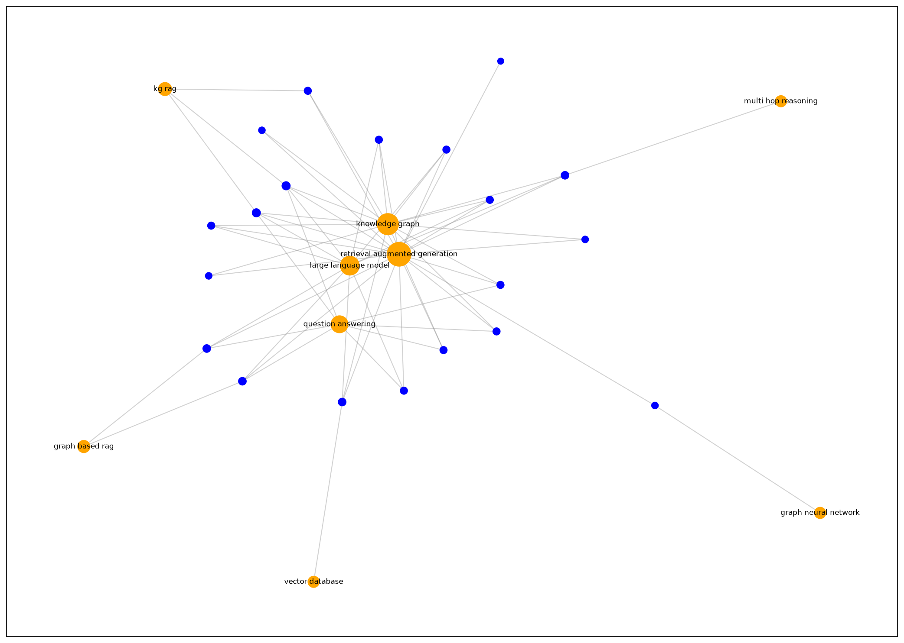

# GraphRAG Mini

A minimal GraphRAG pipeline that builds a knowledge graph from about 20 scientific abstracts, retrieves relevant subgraphs, and answers multi-hop questions with citations. Results will be compared against a plain vector RAG baseline.

## Built So Far

- `fetch_data.py` downloads 20 arXiv abstracts into `data/`.
- `build_graph.py` performs rule-based term extraction, entity resolution, and noise filtering.
- Current results: 20 papers, 9 terms after filtering, and 62 edges.

The current rule-based extraction trades recall for precision. The next step is LLM-based entity and relation extraction.

## Graph

Node size reflects degree; papers are blue and terms are orange.

## Plan

- [x] Collect and prepare scientific abstracts
- [x] Build the knowledge graph
- [ ] Implement relevant-subgraph retrieval
- [ ] Answer multi-hop questions with citations
- [ ] Implement the vector RAG baseline
- [ ] Compare results
